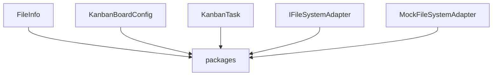

# System Architecture Specification

## 1. Overview
This document provides the architectural description of the system, synchronized with the semantic map.

## 2. System Stakeholders
- Humans: Developers, PMs, Architects
- Agents: Coding Agents, QA Agents

## 3. Logical Structure
The following diagram represents the domain boundaries and dependencies.

## 4. Components & Responsibilities
- **FileInfo**: Located in `packages/shared/src/types/index.ts`. File/directory metadata shape.
- **KanbanBoardConfig**: Located in `packages/shared/src/types/index.ts`. Kanban board data schema.
- **KanbanTask**: Located in `packages/shared/src/types/index.ts`. Kanban task card details schema.
- **IFileSystemAdapter**: Located in `packages/shared/src/interfaces/index.ts`. FileSystem adapter interface contract.
- **MockFileSystemAdapter**: Located in `packages/shared/src/adapters/MockFileSystemAdapter.ts`. LocalStorage-based simulated filesystem adapter.

---
*Auto-generated by Harness Auto-Documentation Hook*
