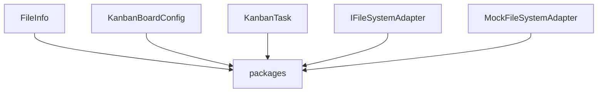
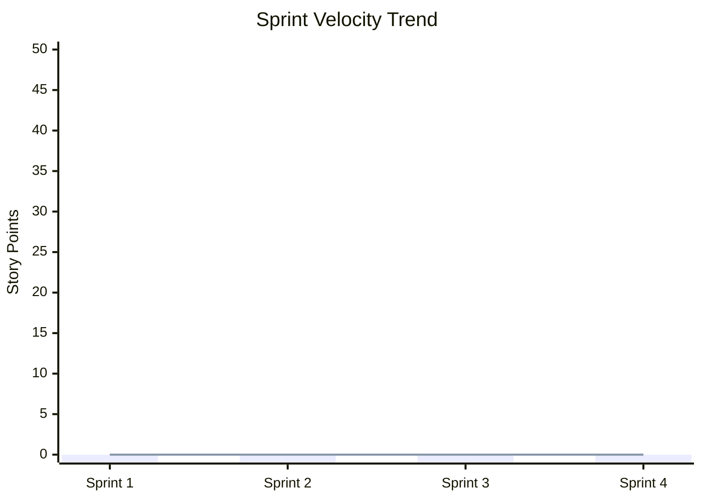

# Project Documentation Index
This is the master index for the fragmented documentation architecture.
All fragments should be referenced here.

=================================================================
# Requirements
=================================================================


<!-- Source: docs/requirements/srs.md -->
# Software Requirements Specification (SRS)

> **Document ID**: SRS-project-progress-board-001
> **Version**: 0.1.0 (Draft)
> **Last Updated**: 2026-05-22
> **Author**: Harness Protocol
> **Status**: Draft | In Review | Approved | Superseded

---

## Quick Start

1. Fill the fragmented sections linked below.
2. Define stakeholders in Stakeholders before writing requirements.
3. Use requirement ID format: `REQ-[MODULE]-[NNN]` (e.g., `REQ-AUTH-001`).
4. Link each requirement to a test case in STD.

---

## Master Index & Lazy-Loading Fragments

AI agents should read only the relevant fragment(s) below to reduce context size.

- **[Section 1: Purpose & Scope](fragments/srs_overview.md)**
  - Scope boundaries, business justifications, definitions.
- **[Section 2: Stakeholders & User Classes](fragments/srs_stakeholders.md)**
  - Stakeholder registry, user profiles, AI agents, use case diagrams.
- **[Section 3: System Overview & Environment](fragments/srs_overview_context.md)**
  - System context, high-level architecture overview, runtime, deployment target.
- **[Section 4: Functional Requirements](fragments/srs_requirements.md)**
  - Requirements catalog, modules, acceptance criteria, test links.
- **[Section 5: Non-Functional Requirements](fragments/srs_non_functional.md)**
  - Performance, security, reliability, scalability, maintainability.
- **[Section 6: External Interface Requirements](fragments/srs_external_interfaces.md)**
  - UI, Software, Hardware, and Communication interfaces.
- **[Section 7: Constraints, Assumptions & Risks](fragments/srs_constraints.md)**
  - Design constraints, assumptions, risks matrix.
- **[Section 8: Traceability, Glossary & References](fragments/srs_traceability.md)**
  - Traceability matrix, acceptance summary, glossary, related docs.


=================================================================
# Architecture
=================================================================


<!-- Source: docs/architecture/api_spec.md -->
# API & Interface Specification (OpenAPI 3.0)

> **Document ID**: API-project-progress-board-001
> **Version**: 0.1.0 (Draft)
> **Last Updated**: 2026-05-22
> **Author**: Harness Protocol
> **Status**: Draft | In Review | Approved | Deprecated
> **SDD Reference**: [SDD-project-progress-board-001](../specs/SDD.md)

---

## Quick Start

1. The OpenAPI specification below is the **machine-readable source of truth** for all public API contracts.
2. Use an OpenAPI viewer (e.g., Swagger UI, Redocly) to render the interactive documentation.
3. Every endpoint must include request/response examples within the spec.
4. Error codes are standardized in `components.schemas.ErrorResponse`.
5. Sub-agent dispatch protocols (harness-specific) are documented in [Section 2](#2-harness-sub-agent-communication-protocol).
6. Version changes require an ADR when breaking.

---

## Master Index & Lazy-Loading Fragments

AI agents should read only the relevant fragment(s) below to reduce context size.

- **[Section 1: OpenAPI 3.0 Specification](fragments/api_spec_openapi.md)**
  - Full YAML OpenAPI declaration including server list, routes (/health, /{resources}), response components, schema properties, validation errors, and security schemes.
- **[Section 2: Harness Sub-Agent Communication Protocol](fragments/api_spec_protocol.md)**
  - Sub-agent task dispatch contract, permission matrix (`QA`, `DEV`, `DOC`), and telemetry data flow.
- **[Section 3: API Design Standards](fragments/api_spec_standards.md)**
  - Endpoint path conventions, query and body casing rules, HTTP method mapping, standard headers, API versioning policy, and rate limits.


<!-- Source: docs/architecture/scs.md -->
# Software Configuration Specification (SCS)

> **Document ID**: SCS-project-progress-board-001
> **Version**: 0.1.0 (Draft)
> **Last Updated**: 2026-05-22
> **Author**: Harness Protocol
> **Status**: Draft | In Review | Approved | Superseded

---

## Quick Start

1. Fill the fragmented sections linked below.
2. Never commit secrets to this document — use references to secret stores only.
3. Every configuration key must have a default value and validation rule.
4. Reference this document from [SDD](../specs/SDD.md) for deployment-specific design decisions.

---

## Master Index & Lazy-Loading Fragments

AI agents should read only the relevant fragment(s) below to reduce context size.

- **[Section 1 & 2: Overview & Environment Matrix](fragments/scs_overview.md)**
  - Document purpose, philosophy, and target environment configurations.
- **[Section 3: Configuration Parameters](fragments/scs_parameters.md)**
  - App, database, and external service configuration tables.
- **[Section 4 & 5: Dependency Versions, Lock Policy & Build Configuration](fragments/scs_dependencies.md)**
  - Dependency pinning, lock files, and build environment/targets.
- **[Section 6: Secret Management](fragments/scs_secrets.md)**
  - Storage strategies, secret inventory, and `.env.example`.
- **[Section 7 & 8: CI/CD Pipeline & Infrastructure as Code](fragments/scs_pipeline.md)**
  - Pipeline stages, branch strategy, and IaC resources.
- **[Section 9, 10 & 11: Rollback, Feature Flags & Monitoring](fragments/scs_operations.md)**
  - Rollback guidelines, Feature Flags, and Monitoring & Alerting configurations.


<!-- Source: docs/architecture/sdd.md -->
# Software Design Document (SDD)

> **Document ID**: SDD-project-progress-board-001
> **Version**: 0.1.0 (Draft)
> **Last Updated**: 2026-05-22
> **Author**: Harness Protocol
> **Status**: Draft | In Review | Approved | Superseded
> **SRS Reference**: [SRS-project-progress-board-001](../specs/SRS.md)

---

## Quick Start

1. Ensure the SRS is at least in "In Review" status before writing this document
2. Start with Architecture Overview (Section 2) — draw the big picture first
3. Each component in Component Design (Section 3) MUST map to at least one SRS requirement
4. Use mermaid diagrams for all visual representations
5. Reference ADR for every significant design choice

---

## Master Index & Lazy-Loading Fragments

AI agents should read only the relevant fragment(s) below to reduce context size.

- **[Section 1 & 2: Introduction & Architecture Overview](fragments/sdd_overview.md)**
  - Design philosophy, technology stack, system architecture diagram, patterns, boundaries, module boundary maps.
- **[Section 3: Component Design](fragments/sdd_components.md)**
  - Class structures, state management, concurrency models, public interfaces, and dependency diagrams.
- **[Section 4: Data Design & Safe Migrations](fragments/sdd_data.md)**
  - Entity relationship diagrams (ERD), data dictionaries, data flows, and safe migration policies.
- **[Section 5: Interface Design](fragments/sdd_interfaces.md)**
  - Internal (module-to-module) and external service interfaces.
- **[Section 6: Sequence Diagrams](fragments/sdd_flow.md)**
  - Critical paths, primary user flows, and error recovery sequence diagrams.
- **[Section 7, 8, & 9: Operations, Dependencies, Resilience & Security](fragments/sdd_operations.md)**
  - Dependency trees, error classification, retry policies, logging standards, auth/authz, data protection.

---

## Related Documents

| Document | Path | Relationship |
|---|---|---|
| Software Requirements Specification | `docs/specs/SRS.md` | Requirements this design implements |
| Software Configuration Specification | `docs/specs/SCS.md` | Configuration & environment details |
| Architecture Decision Records | `docs/decisions/ADR-*.md` | Formal decision rationale |
| API Specification | `docs/api/API_SPEC.md` | Detailed interface contracts |
| Semantic Map | `docs/map.md` | Auto-generated symbol index |


<!-- Source: docs/architecture/system_architecture.md -->
# System Architecture Specification

## 1. Overview
This document provides the architectural description of the system, synchronized with the semantic map.

## 2. System Stakeholders
- Humans: Developers, PMs, Architects
- Agents: Coding Agents, QA Agents

## 3. Logical Structure
The following diagram represents the domain boundaries and dependencies.



## 4. Components & Responsibilities
- **FileInfo**: Located in `packages/shared/src/types/index.ts`. File/directory metadata shape.
- **KanbanBoardConfig**: Located in `packages/shared/src/types/index.ts`. Kanban board data schema.
- **KanbanTask**: Located in `packages/shared/src/types/index.ts`. Kanban task card details schema.
- **IFileSystemAdapter**: Located in `packages/shared/src/interfaces/index.ts`. FileSystem adapter interface contract.
- **MockFileSystemAdapter**: Located in `packages/shared/src/adapters/MockFileSystemAdapter.ts`. LocalStorage-based simulated filesystem adapter.

---
*Auto-generated by Harness Auto-Documentation Hook*


=================================================================
# Management & Operations
=================================================================


<!-- Source: docs/management/adr-001.md -->
# Architecture Decision Record (ADR)

> **ADR ID**: ADR-{NNN}
> **Title**: {Decision Title}
> **Date**: 2026-05-22
> **Status**: Proposed | Accepted | Deprecated | Superseded by [ADR-{NNN}]
> **Deciders**: {List of people/agents who made this decision}

---

## Quick Start

1. Create one ADR per significant architectural decision
2. ADRs are **immutable once Accepted** — to change a decision, create a new ADR that supersedes it
3. Number ADRs sequentially: ADR-001, ADR-002, etc.
4. Link ADRs from [SDD](../specs/SDD.md) and [SRS](../specs/SRS.md) requirement traceability

---

## Context

Describe the situation that requires a decision. Include:

- **Background**: What is the technical/business context?
- **Problem Statement**: What specific problem needs solving?
- **Constraints**: What limitations exist? (budget, timeline, team skill, existing tech)
- **Driving Requirements**: Which SRS requirements drive this decision?
  - REQ-{MODULE}-{NNN}: {Brief description}

---

## Decision Drivers

Rank the factors that influenced this decision (most important first):

1. **{Factor 1}**: {e.g., "Performance under high concurrency" — Weight: Critical}
2. **{Factor 2}**: {e.g., "Team familiarity with technology" — Weight: High}
3. **{Factor 3}**: {e.g., "Long-term maintenance cost" — Weight: Medium}
4. **{Factor 4}**: {e.g., "Community support and ecosystem" — Weight: Low}

---

## Considered Options

### Option A: {Option Name}

**Description**: {What this option involves}

| Pros | Cons |
|---|---|
| {Advantage 1} | {Disadvantage 1} |
| {Advantage 2} | {Disadvantage 2} |

**Estimated Effort**: {S/M/L/XL}
**Risk Level**: {Low / Medium / High}

### Option B: {Option Name}

**Description**: {What this option involves}

| Pros | Cons |
|---|---|
| {Advantage 1} | {Disadvantage 1} |
| {Advantage 2} | {Disadvantage 2} |

**Estimated Effort**: {S/M/L/XL}
**Risk Level**: {Low / Medium / High}

### Option C: {Option Name} *(if applicable)*

**Description**: {What this option involves}

| Pros | Cons |
|---|---|
| {Advantage 1} | {Disadvantage 1} |

---

## Decision

**Chosen Option**: {Option X}

**Rationale**: {Explain WHY this option was chosen over alternatives. Reference the decision drivers above. Be specific about what tipped the balance.}

**Trade-offs Accepted**:
- {What we sacrifice by choosing this option}
- {What risks we accept}

---

## Consequences

### Positive

- {What improves as a result of this decision}
- {What becomes easier or more efficient}

### Negative

- {What becomes harder or more constrained}
- {What technical debt is introduced}

### Neutral

- {Side effects that are neither positive nor negative}

---

## Implementation Notes

- **Affected Components**: {List components from [SDD](../specs/SDD.md) that change}
- **Migration Required**: {Yes / No — describe if yes}
- **Reversibility**: {Easy / Difficult / Irreversible}
- **Validation**: {How will we verify this decision was correct? Metrics to track.}

---

## Follow-up Actions

| Action | Owner | Due Date | Status |
|---|---|---|---|
| {Implement chosen option} | {Name/Agent} | 2026-05-22 | {To Do / Done} |
| {Update SDD to reflect decision} | {Name} | 2026-05-22 | {To Do} |
| {Monitor metrics for validation} | {Name} | {DATE + 30d} | {To Do} |

---

## Actual Consequences (Post-Implementation Review)

> Fill this section 2-4 weeks after implementation to track whether predictions were accurate.

| Predicted Consequence | Actual Outcome | Accuracy |
|---|---|---|
| {Positive: improved performance} | {Measured: 40% latency reduction} | ✅ Confirmed |
| {Negative: increased memory usage} | {Measured: 15% increase, within budget} | ✅ Confirmed |
| {Risk: migration downtime} | {Actual: zero downtime} | ⬆️ Better than expected |

**Would we make the same decision again?** {Yes / No — explain}

---

## Related Documents

| Document | Path | Relationship |
|---|---|---|
| Software Design Document | `docs/specs/SDD.md` | Design implementing this decision |
| Software Requirements Specification | `docs/specs/SRS.md` | Requirements driving this decision |
| Previous ADR | `docs/decisions/ADR-{NNN-1}.md` | Related/superseded decision |


<!-- Source: docs/management/kanban.md -->
# Kanban Board — Task Tracking (SSOT View)

> ⚠️ **AUTO-GENERATED DOCUMENT**: Do NOT edit this file directly.
> Run `harness.sh kanban-render` to regenerate from `docs/tasks/*.json`.
> Manual edits will be overwritten on next render.

> **Project**: project-progress-board
> **Last Updated**: 2026-05-22
> **Board Owner**: {OWNER}
> **Source of Truth**: `docs/tasks/*.json`

---

## Quick Start

1. Every task MUST have a unique ID matching `docs/tasks/{task_id}.json`
2. WIP limits are hard limits — do NOT exceed them without escalation
3. Move cards left-to-right only (no skipping columns)
4. Blocked tasks move to the Blocked lane with a reason tag

---

## Board Configuration

### Column Definitions

| Column | Purpose | Entry Criteria | Exit Criteria | WIP Limit |
|---|---|---|---|---|
| **Backlog** | Unrefined work items | Identified need or requirement | Refined with acceptance criteria | No limit |
| **Ready** | Refined, estimated, and prioritized | SRS requirement linked, acceptance criteria defined | Assigned to agent/developer | 10 |
| **In Progress** | Active development (RED/GREEN cycle) | Cycle log initialized, harness task JSON created | Tests pass, coverage ≥ 80% (harness verified) | **3** |
| **Review** | Code review / QA validation | Harness status = `Verified`, PR opened | Approved by reviewer, no blocking comments | **3** |
| **Done** | Completed and merged | Harness status = `Approved`, committed | Deployed to target environment | No limit |
| **Blocked** | Impediments preventing progress | Blocker identified and tagged | Blocker resolved, return to previous column | No limit |

### WIP Limit Escalation Policy

> When a column reaches its WIP limit:
> 1. **Stop Starting, Start Finishing**: No new tasks enter the column until one exits
> 2. **Swarm**: Team members without WIP-limited tasks help finish blocked items
> 3. **Escalate**: If blocked for > 24h, escalate to {ESCALATION_CONTACT}
> 4. **Log**: Record the bottleneck in [Troubleshooting Log](../troubleshooting/TROUBLESHOOTING.md)

### Priority Lanes

| Lane | Criteria | Max Items | SLA |
|---|---|---|---|
| **Expedite** | Production hotfix, P0 defect | 1 | Resolved within 4h |
| **Standard** | Normal priority work | Per WIP limits | Per sprint cadence |
| **Low Priority** | Nice-to-have, tech debt | 2 | Best effort |

---

## Board State

### Backlog

| Task ID | Title | Priority | SRS Req | Assignee | Age (days) |
|---|---|---|---|---|---|
| {TASK-XXX} | {Description} | {P0/P1/P2/P3} | {REQ-XXX-NNN} | — | {N} |

### Ready

| Task ID | Title | Priority | Assignee | Estimated Size | Waiting Since |
|---|---|---|---|---|---|
| {TASK-XXX} | {Description} | {P0} | {Agent/DEV} | {S/M/L/XL} | 2026-05-22 |

### In Progress (WIP: 0 / 3)

| Task ID | Title | Agent/DEV | Phase | Cycle Log | Started | Elapsed |
|---|---|---|---|---|---|---|
| {TASK-XXX} | {Description} | {antigravity/jules/dev} | {RED/GREEN/DOC} | [Log](docs/cycle_logs/{task_id}_log.md) | 2026-05-22 | {Nh} |

### Review (WIP: 0 / 3)

| Task ID | Title | Reviewer | Coverage | Harness Status | PR Link | Review Started |
|---|---|---|---|---|---|---|
| {TASK-XXX} | {Description} | {Reviewer} | {85%} | Verified | {PR link} | 2026-05-22 |

### Done (This Sprint/Period)

| Task ID | Title | Completed | Cycle Time | Retries | Coverage |
|---|---|---|---|---|---|
| {TASK-XXX} | {Description} | 2026-05-22 | {Nd Nh} | {N} | {N%} |

### Blocked

| Task ID | Title | Blocked Since | Blocker Type | Blocker Description | Escalated? |
|---|---|---|---|---|---|
| {TASK-XXX} | {Description} | 2026-05-22 | {Dependency / External / Technical / Decision} | {What is blocking} | {Yes/No} |

---

## Metrics & Analytics

### Cycle Time Tracking

| Period | Avg Cycle Time | Median | P90 | Throughput (tasks/week) |
|---|---|---|---|---|
| {Week/Sprint N} | {Nd Nh} | {Nd Nh} | {Nd Nh} | {N} |

### Cumulative Flow Diagram Data

| Date | Backlog | Ready | In Progress | Review | Done | Blocked |
|---|---|---|---|---|---|---|
| 2026-05-22 | {N} | {N} | {N} | {N} | {N} | {N} |

### Bottleneck Analysis

| Date | Column | WIP at Limit? | Duration | Root Cause | Action Taken |
|---|---|---|---|---|---|
| 2026-05-22 | {In Progress} | {Yes} | {8h} | {Agent retry loop} | {Manual intervention} |

---

## Harness Integration

The Kanban board state synchronizes with harness telemetry:

| Harness Status | Kanban Column |
|---|---|
| `Ready` | Ready |
| Task JSON created + cycle log initialized | In Progress |
| `Verified` | Review |
| `Approved` | Done |
| `Failed` (retry_count < 3) | In Progress (retry) |
| `Failed` (retry_count >= 3) | Blocked |

---

## Board Policies

### Definition of Ready (DoR)

- [ ] SRS requirement identified and linked
- [ ] Acceptance criteria written (GIVEN/WHEN/THEN)
- [ ] Dependencies identified and resolved or tracked
- [ ] Size estimated (S/M/L/XL)
- [ ] Target agent or developer assigned

### Definition of Done (DoD)

- [ ] All acceptance criteria pass
- [ ] Harness verification: status = `Verified`, coverage ≥ 80%
- [ ] Cycle log completed with reasoning documentation
- [ ] ISO documentation synchronized (`harness.sh document`)
- [ ] Code reviewed and approved
- [ ] No known regressions introduced

---

## Related Documents

| Document | Path | Relationship |
|---|---|---|
| Scrum Sprint Tracking | `docs/agile/SCRUM.md` | Sprint-level planning and velocity |
| Task Registry | `docs/tasks/*.json` | Harness task state (source of truth) |
| Troubleshooting Log | `docs/troubleshooting/TROUBLESHOOTING.md` | Blocker resolution history |


<!-- Source: docs/management/quality_metrics.md -->
# Quality Metrics Dashboard

## 1. Quality Model Overview
This report tracks system quality based on automated telemetry data.

## 2. Maintainability Metrics
- **Line Coverage (Avg):** 96.81%
- **Total Tasks:** 3
- **Retry Rate:** 100.00%

## 3. Reliability Metrics
- **Success Rate:** 100.00%
- **Avg Duration:** 7.33s

## 4. Detailed Task Metrics
| Task ID | Status | Coverage | Mutation Score | Duration | Retries |
|---------|--------|----------|----------------|----------|---------|
| TSK-1.1 | Verified | 93.62% | N/A | 12s | 3 |
| TSK-1.2-GREEN | Verified | 100.00% | N/A | 4s | 0 |
| TSK-1.2-RED | Verified | RED | N/A | 6s | 0 |

## 5. Cost & Token Dashboard

### 5.1 Token Usage by Task
| Task ID | Tokens Used |
|---------|-------------|
| TSK-1.1 | 0 |
| TSK-1.2-GREEN | 0 |
| TSK-1.2-RED | 0 |

### 5.2 Aggregate Cost Metrics
| Metric | Value |
|--------|-------|
| **Total Tokens Used** | 0 |
| **Estimated Cost (USD)** | $0.0000 |
| **Cost Rate** | $0.003 / 1K tokens |

> **Note**: Cost rate is configurable. Adjust the rate in `.harness/config.json` (`cost_per_1k_tokens` field) to match your LLM provider pricing.

---
*Auto-generated by Harness Auto-Documentation Hook v3.0.0*


<!-- Source: docs/management/scrum.md -->
# Scrum — Sprint & Daily Progress

> **Project**: project-progress-board
> **Scrum Master**: {SCRUM_MASTER}
> **Product Owner**: {PRODUCT_OWNER}
> **Sprint Duration**: {1 week / 2 weeks}

---

## Quick Start

1. Sprint planning happens at the start of each sprint — fill Section 2
2. Daily standup logs go in Section 3 — one entry per day
3. Sprint review (Section 4) includes harness telemetry metrics
4. Retrospective (Section 5) produces actionable improvement items
5. The Definition of Done MUST align with harness mechanical DoD (coverage ≥ 80%, verified status)

---

## 1. Sprint Overview

### Current Sprint

| Attribute | Value |
|---|---|
| **Sprint Number** | {N} |
| **Sprint Goal** | {One sentence describing the sprint's primary objective} |
| **Start Date** | 2026-05-22 |
| **End Date** | 2026-05-22 |
| **Team Capacity** | {N story points / N hours} |
| **Committed Velocity** | {N story points} |

### Team Roster

| Member / Agent | Role | Availability | Focus Area |
|---|---|---|---|
| {Developer Name} | Developer | {100% / 80%} | {Backend / Frontend / Full-stack} |
| {antigravity} | AI Agent (DEV/QA) | Continuous | {Task execution via harness} |
| {jules} | AI Agent (PR) | 15 concurrent max | {Async PR generation} |
| {gemini_cli} | AI Agent (Script) | On-demand | {Quick scripting tasks} |

---

## 2. Sprint Planning

### 2.1 Sprint Backlog

| Task ID | User Story / Description | Priority | Size (SP) | Assignee | SRS Req | Status |
|---|---|---|---|---|---|---|
| {TASK-XXX} | {As a [user], I want [feature] so that [benefit]} | {P0} | {3} | {Agent/DEV} | {REQ-XXX-NNN} | {To Do / In Progress / Done} |
| {TASK-XXX} | {Description} | {P1} | {5} | {Agent/DEV} | {REQ-XXX-NNN} | {To Do} |

**Total Committed**: {N} story points

### 2.2 Sprint Capacity & Risk

| Risk | Probability | Impact | Mitigation |
|---|---|---|---|
| {Key developer unavailable} | {Low} | {High} | {Cross-train backup, delegate to AI agent} |
| {External API dependency delay} | {Medium} | {Medium} | {Use mock/stub, flag as blocked} |

---

## 3. Daily Standup Log

### Day {N} — 2026-05-22

| Member / Agent | Yesterday | Today | Blockers |
|---|---|---|---|
| {Name} | {What was completed} | {What will be worked on} | {None / Description} |
| {antigravity} | {TASK-XXX: GREEN phase verified, 87% coverage} | {TASK-YYY: RED phase — writing tests} | {None} |
| {jules} | {PR #42 opened for TASK-ZZZ} | {PR #43 for TASK-AAA} | {Merge conflict on shared module} |

**Standup Notes**: {Any decisions made, parking lot items}

---

### Day {N+1} — 2026-05-22

| Member / Agent | Yesterday | Today | Blockers |
|---|---|---|---|
| | | | |

---

## 4. Sprint Review

### 4.1 Delivery Summary

| Metric | Target | Actual | Delta |
|---|---|---|---|
| Story Points Completed | {N} | {N} | {+/-N} |
| Tasks Completed | {N} | {N} | {+/-N} |
| Tasks Carried Over | 0 | {N} | — |
| Bugs Found | — | {N} | — |

### 4.2 Harness Telemetry Summary

> Auto-populated from `harness.sh document --standard ISO_25010`

| Metric | Sprint Value | Trend (vs. Last Sprint) |
|---|---|---|
| **Avg Line Coverage** | {N}% | {↑/↓/→} |
| **Success Rate** | {N}% | {↑/↓/→} |
| **Avg Retry Count** | {N} | {↑/↓/→} (lower is better) |
| **Avg Task Duration** | {N}s | {↑/↓/→} (lower is better) |
| **Total Tokens Used** | {N} | {↑/↓/→} |

### 4.3 Task Detail

| Task ID | Title | Assignee | Status | Coverage | Retries | Duration | Notes |
|---|---|---|---|---|---|---|---|
| {TASK-XXX} | {Description} | {Agent/DEV} | {Verified/Approved} | {85%} | {1} | {45s} | {Completed successfully} |
| {TASK-YYY} | {Description} | {Agent/DEV} | {Failed→Carried Over} | {65%} | {3} | {120s} | {Coverage gap in edge cases} |

### 4.4 Demo Notes

| Feature | Demonstrated? | Stakeholder Feedback | Action Items |
|---|---|---|---|
| {Feature A} | Yes / No | {Positive / Needs revision} | {None / ADR needed} |

---

## 5. Sprint Retrospective

### 5.1 What Went Well

- {Item 1}
- {Item 2}

### 5.2 What Didn't Go Well

- {Item 1}
- {Item 2}

### 5.3 Action Items

| Action | Owner | Due Date | Status |
|---|---|---|---|
| {Improve test coverage for module X} | {Name} | 2026-05-22 | {To Do / Done} |
| {Reduce agent retry rate by improving prompt clarity} | {Name} | 2026-05-22 | {To Do} |

### 5.4 Process Metrics

| Metric | This Sprint | Last Sprint | Target |
|---|---|---|---|
| Velocity (SP) | {N} | {N} | {N} |
| Lead Time (avg) | {Nd} | {Nd} | {< Nd} |
| Cycle Time (avg) | {Nh} | {Nh} | {< Nh} |
| Escaped Defects | {N} | {N} | 0 |

---

## 6. Velocity Tracking (Historical)

| Sprint | Committed (SP) | Completed (SP) | Velocity | Avg Coverage | Avg Retries |
|---|---|---|---|---|---|
| Sprint 1 | {N} | {N} | {N} | {N}% | {N} |
| Sprint 2 | {N} | {N} | {N} | {N}% | {N} |



---

## 7. Definition of Done (Sprint-Level)

Aligned with Harness Protocol mechanical DoD:

- [ ] All committed user stories meet acceptance criteria
- [ ] Harness verification passed: status = `Verified` for all tasks
- [ ] Line coverage ≥ 80% for all GREEN tasks (LCOV validated)
- [ ] Cycle logs completed for all tasks
- [ ] ISO documentation synchronized (`harness.sh document`)
- [ ] No P0/P1 bugs remaining open
- [ ] Sprint review conducted with stakeholders
- [ ] Retrospective completed with action items assigned

---

## Related Documents

| Document | Path | Relationship |
|---|---|---|
| Kanban Board | `docs/agile/KANBAN.md` | Detailed task-level tracking |
| Task Registry | `docs/tasks/*.json` | Harness task state |
| Quality Metrics | `docs/quality_metrics.md` | Auto-generated by harness (ISO 25010) |
| Software Test Report | `docs/testing/STR.md` | Test execution results per sprint |


<!-- Source: docs/management/troubleshooting.md -->
# Troubleshooting Log

> **Project**: project-progress-board
> **Last Updated**: 2026-05-22
> **Maintainer**: {MAINTAINER}

---

## Quick Start

1. Log every non-trivial error encountered during development — not just the fix, but the journey
2. Assign severity (P0-P3) and searchable tags immediately
3. Document ALL attempted solutions, including failed ones — this prevents future teams from repeating mistakes
4. Link to related task IDs, cycle logs, and ADRs
5. Search this document first before debugging a new issue

---

## Severity Classification

| Severity | Definition | Response Time | Escalation |
|---|---|---|---|
| **P0 — Critical** | System down, data loss risk, security breach | Immediate (< 1h) | {Escalation contact} |
| **P1 — High** | Major feature broken, no workaround | Same day (< 4h) | {Team lead} |
| **P2 — Medium** | Feature degraded, workaround available | Within sprint | {Sprint planning} |
| **P3 — Low** | Cosmetic, minor inconvenience | Best effort | {Backlog} |

---

## Tag Taxonomy

Use these tags for searchability. Combine multiple tags per entry.

| Category | Tags |
|---|---|
| **Component** | `#backend` `#frontend` `#database` `#infra` `#ci-cd` `#harness` `#agent` |
| **Error Type** | `#build-failure` `#runtime-error` `#test-failure` `#coverage-gap` `#timeout` `#memory-leak` `#permission` `#dependency` |
| **Root Cause** | `#config-error` `#race-condition` `#missing-dep` `#version-mismatch` `#api-change` `#data-corruption` `#env-diff` |
| **Agent-Specific** | `#agent-loop` `#hallucination` `#scope-violation` `#integrity-violation` `#cycle-log-stale` |

---

## Incident Log

### Entry Template

> Copy this block for each incident:

---

### INC-{NNN}: {Brief Title}

| Attribute | Value |
|---|---|
| **Date** | 2026-05-22 |
| **Severity** | {P0 / P1 / P2 / P3} |
| **Tags** | {#tag1 #tag2 #tag3} |
| **Reporter** | {Name / Agent} |
| **Task ID** | {TASK-XXX or N/A} |
| **Environment** | {Development / CI / Staging / Production} |
| **Status** | {Open / Investigating / Resolved / Won't Fix} |
| **Resolution Time** | {Nh / Nd} |

#### Symptom

{What was observed? Error messages, unexpected behavior, stack traces.}

```
{Paste relevant error output / stack trace here}
```

#### Context

- **What was being done**: {What task/action triggered the error}
- **Recent changes**: {What changed recently that might be related}
- **Frequency**: {Always / Intermittent / Once}
- **Impact**: {Who/what is affected}

#### Root Cause Analysis

{After investigation, what was the actual underlying cause?}

**Why-Why-Why Chain** (5 Whys):
1. Why did {symptom} occur? → Because {cause 1}
2. Why did {cause 1} occur? → Because {cause 2}
3. Why did {cause 2} occur? → Because {root cause}

#### Attempted Solutions Timeline

| # | Date/Time | Attempted Solution | Result | Time Spent |
|---|---|---|---|---|
| 1 | {DATETIME} | {First thing tried} | ❌ {Why it didn't work} | {30m} |
| 2 | {DATETIME} | {Second thing tried} | ❌ {Why it didn't work} | {1h} |
| 3 | {DATETIME} | {Final solution} | ✅ {How it resolved the issue} | {15m} |

#### Resolution

{Detailed description of the final fix. Include code snippets, config changes, or commands.}

```diff
- old_broken_code()
+ new_fixed_code()
```

**Commit**: `{commit_sha}` — `{commit message}`

#### Prevention Measures

- {What was done to prevent recurrence}
- {Test case added: TC-XXX-NNN}
- {Monitoring/alert added}
- {Documentation updated}
- {ADR created: ADR-{NNN}}

#### Lessons Learned

{What would you tell someone who encounters this issue in the future?}

---

### INC-001: {Example — First Incident}

*(Use template above)*

---

## Summary Statistics

### Incidents by Severity

| Severity | Open | Resolved | Total | Avg Resolution Time |
|---|---|---|---|---|
| P0 | {0} | {0} | {0} | {—} |
| P1 | {0} | {0} | {0} | {—} |
| P2 | {0} | {0} | {0} | {—} |
| P3 | {0} | {0} | {0} | {—} |

### Incidents by Tag (Top 10)

| Tag | Count | Most Common Root Cause |
|---|---|---|
| {#tag} | {N} | {root cause pattern} |

### Monthly Trend

| Month | New Incidents | Resolved | Net Open | Avg Resolution Time |
|---|---|---|---|---|
| {YYYY-MM} | {N} | {N} | {N} | {Nh} |

---

## Known Issues (Active)

| INC ID | Severity | Title | Workaround | ETA for Fix |
|---|---|---|---|---|
| INC-{NNN} | {P2} | {Brief title} | {Describe workaround} | {DATE or TBD} |

---

## Related Documents

| Document | Path | Relationship |
|---|---|---|
| Software Test Report | `docs/testing/STR.md` | Test failure details |
| Kanban Board | `docs/agile/KANBAN.md` | Blocked task tracking |
| Architecture Decision Records | `docs/decisions/ADR-*.md` | Decisions made from incidents |
| Cycle Logs | `docs/cycle_logs/*.md` | Agent reasoning during failures |


<!-- Source: docs/management/wbs.md -->
# Work Breakdown Structure (WBS)

> **Document ID**: WBS-project-progress-board-001
> **Version**: 0.1.0 (Draft)
> **Last Updated**: 2026-05-22
> **Author**: Harness Protocol
> **Status**: Draft | In Review | Approved | Superseded

---

## Quick Start

1. Break work into **Phase → Task → Sub-task** hierarchy (max 3 levels)
2. Every item MUST have a unique Task ID matching `docs/tasks/{task_id}.json`
3. Assign each item to either `Human` or `Agent` (or specific sub-agent: `QA`, `DEV`, `DOC`)
4. Define dependencies BEFORE starting work — no circular dependencies allowed
5. Update status as work progresses: `Not Started` → `In Progress` → `Completed` → `Verified`

---

## Master Index & Lazy-Loading Fragments

AI agents should read only the relevant fragment(s) below to reduce context size.

- **[Section 1 & 2: WBS Overview & Dictionary](fragments/wbs_overview.md)**
  - Purpose, numbering conventions, status definitions, and WBS work package dictionary template.
- **[Section 3: Work Breakdown Tables](fragments/wbs_tasks.md)**
  - Phase breakdown, task assignees, estimates, dependencies, and sub-task tables.
- **[Section 4 & 5: Dependency Graph & Gantt Chart](fragments/wbs_schedule.md)**
  - Mermaid diagrams for visual dependency routing and project schedules.
- **[Section 6, 7, 8, & 9: Resources, Estimation, Revision History & Related Docs](fragments/wbs_resources.md)**
  - Resource matrices, effort analysis, critical path, risk buffers, revisions, and relationships.

---

## Harness Integration

### Task JSON Mapping

Each WBS task should have a corresponding `docs/tasks/{task_id}.json` entry:

| WBS Field | Task JSON Field |
|---|---|
| Task ID | `.id` |
| Assignee | `.assigned_sub_agent` |
| Status | `.status` |
| Dependencies | `.depends_on` |
| Estimated Hours | `.estimated_hours` (optional) |

### Workflow

1. **Create WBS** → Define all phases, tasks, and sub-tasks
2. **Generate Task JSONs** → `harness.sh docs-init` + create task files for each WBS item
3. **Execute** → Follow RED→GREEN→DOC cycle per task, in dependency order
4. **Track** → Run `harness.sh kanban-render` to update the live Kanban view
5. **Report** → Run `harness.sh document --standard QUALITY_METRICS` for quality metrics


=================================================================
# Testing
=================================================================


<!-- Source: docs/testing/std.md -->
# Software Test Design (STD)

> **Document ID**: STD-project-progress-board-001
> **Version**: 0.1.0 (Draft)
> **Last Updated**: 2026-05-22
> **Author**: Harness Protocol
> **Status**: Draft | In Review | Approved
> **SRS Reference**: [SRS-project-progress-board-001](../specs/SRS.md)

---

## Quick Start

1. Every test case MUST trace to an SRS requirement via ID.
2. Follow TDD-RED/GREEN protocol: write STD entries BEFORE implementation.
3. Test case IDs follow format: `TC-{MODULE}-{NNN}`.
4. Coverage target: ≥ 80% line coverage (harness enforced).
5. RED phase tests MUST produce `AssertionError` (not `SyntaxError`).

---

## Master Index & Lazy-Loading Fragments

AI agents should read only the relevant fragment(s) below to reduce context size.

- **[Section 1 & 2: Test Strategy & Environment Setup](fragments/std_strategy.md)**
  - Testing levels, TDD protocol alignment, and environment configuration / procedures.
- **[Section 3: Test Case Specification](fragments/std_cases.md)**
  - Test case template, and module-specific test cases (TC).
- **[Section 4, 5 & 6: Boundary Analysis, Regression Suite & Mutation Testing](fragments/std_analysis.md)**
  - Boundary value tests, regression smoke/core definitions, and mutation strategy.
- **[Section 7 & 8: Integration & Performance Test Scenarios](fragments/std_scenarios.md)**
  - Component interactions and load testing (steady state, peak, stress) parameters.
- **[Section 9 & 10: Test Data Management & Traceability Matrix](fragments/std_data.md)**
  - Seed/mock data strategies, fixtures inventory, and SRS requirements traceability matrix.


<!-- Source: docs/testing/str.md -->
# Software Test Report (STR)

> **Document ID**: STR-project-progress-board-001
> **Version**: 0.1.0
> **Last Updated**: 2026-05-22
> **Author**: Harness Protocol / Harness Auto-Documentation
> **Sprint/Release**: {Sprint N / v1.0.0}
> **STD Reference**: [STD-project-progress-board-001](../testing/STD.md)

---

## Quick Start

1. This document is partially auto-populated by `harness.sh test` results.
2. Section 2 (Execution Summary) updates automatically from telemetry.
3. Section 3 (Detailed Results) requires manual curation for failed tests.
4. Review after each sprint or release milestone.

---

## Master Index & Lazy-Loading Fragments

AI agents should read only the relevant fragment(s) below to reduce context size.

- **[Section 1 & 2: Test Execution Overview & Telemetry Summary](fragments/str_overview.md)**
  - Scope boundaries, overall verdict metrics, task-level results, and aggregate telemetry.
- **[Section 3 & 4: Detailed Test Results & Coverage Analysis](fragments/str_results.md)**
  - Pass/fail/skip registry, coverage by module, uncovered code analysis, and trend timeline.
- **[Section 5, 6, 7, 8 & 9: Defect Summary, CI/CD, Risks & Recommendations](fragments/str_analysis.md)**
  - Defect density/aging metrics, pipeline logs, risk mitigation, and team sign-off.

