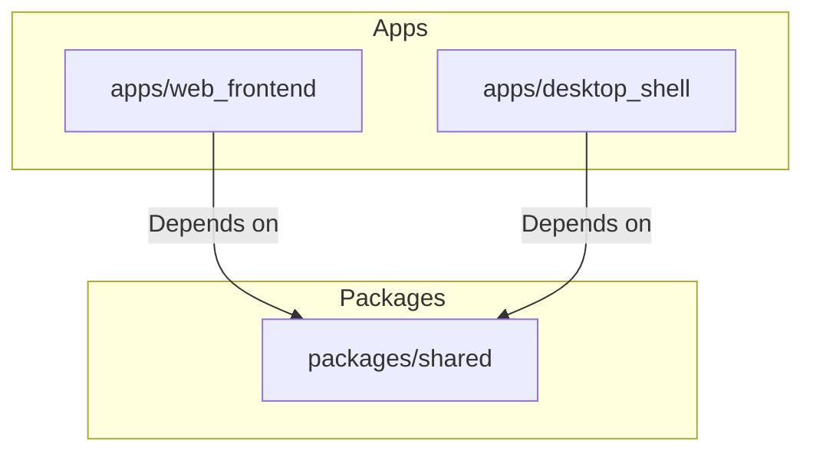

# Monorepo Topology & Dependency Design

This document details the Turborepo monorepo layout, workspace relationships, and environment configurations designed for cross-platform integration.

---

## 1. Directory Tree Overview

We structure the project as a monorepo to isolate core React frontend code from Electron main-process shell files while allowing shared API contracts.

```
project-progress-board/
├── package.json
├── turbo.json
├── apps/
│   ├── web_frontend/           # SPA frontend (Vite + React + TS)
│   │   ├── package.json
│   │   ├── vite.config.ts
│   │   └── src/
│   └── desktop_shell/          # Electron Main Process & Preload
│       ├── package.json
│       ├── src/
│       │   ├── main.ts         # Electron window creation & IPC listeners
│       │   └── preload.ts      # Context bridge exposing whitelisted APIs
│       └── tsconfig.json
└── packages/
    └── shared/                 # Core Interfaces, Types & Mock Adapters
        ├── package.json
        ├── src/
        │   ├── types/          # Kanban types (Board, Task, Column)
        │   ├── interfaces/     # FileSystem abstractions
        │   └── adapters/       # MockFileSystemAdapter implementation
        └── tsconfig.json
```

---

## 2. Workspace Dependencies



### Dependency Declarations

#### `apps/web_frontend/package.json`
```json
{
  "name": "web-frontend",
  "dependencies": {
    "react": "^18.3.1",
    "react-dom": "^18.3.1",
    "react-router-dom": "^6.23.1",
    "shared": "workspace:*"
  },
  "devDependencies": {
    "vite": "^5.2.11",
    "typescript": "^5.4.5"
  }
}
```

#### `packages/shared/package.json`
```json
{
  "name": "shared",
  "version": "1.0.0",
  "main": "./dist/index.js",
  "types": "./dist/index.d.ts",
  "exports": {
    ".": {
      "import": "./dist/index.js",
      "require": "./dist/index.js",
      "types": "./dist/index.d.ts"
    }
  },
  "dependencies": {
    "zod": "^3.23.8"
  }
}
```

---

## 3. Turborepo Configuration (`turbo.json`)

To orchestrate parallel builds and utilize caching pipelines, the root `turbo.json` is configured as follows:

```json
{
  "$schema": "https://turbo.build/schema.json",
  "pipeline": {
    "build": {
      "dependsOn": ["^build"],
      "outputs": ["dist/**", "out/**"]
    },
    "test": {
      "dependsOn": ["build"],
      "outputs": ["coverage/**"]
    },
    "lint": {},
    "dev": {
      "cache": false,
      "persistent": true
    }
  }
}
```

---

## 4. Environment Variables Configuration

We use environment variables to differentiate build modes and mock setups.

| Variable Name | Permitted Values | Location | Description |
|---|---|---|---|
| `VITE_PLATFORM_MODE` | `web` \| `electron` | `.env.local` / Build Scripts | Instructs the factory which adapter mode to force initialize. |
| `VITE_MOCK_STORAGE_KEY` | `string` | `.env` | LocalStorage namespace key for Mock FS data storage. |

### Build Script Scripts (Root `package.json`)
- `npm run dev`: Runs `vite` in standalone localhost browser mode (`VITE_PLATFORM_MODE=web`).
- `npm run dev:desktop`: Starts `vite` in web mode but concurrently boots Electron loaded to localhost port (`VITE_PLATFORM_MODE=electron`).
- `npm run build`: Generates static export files in `apps/web_frontend/dist`.
